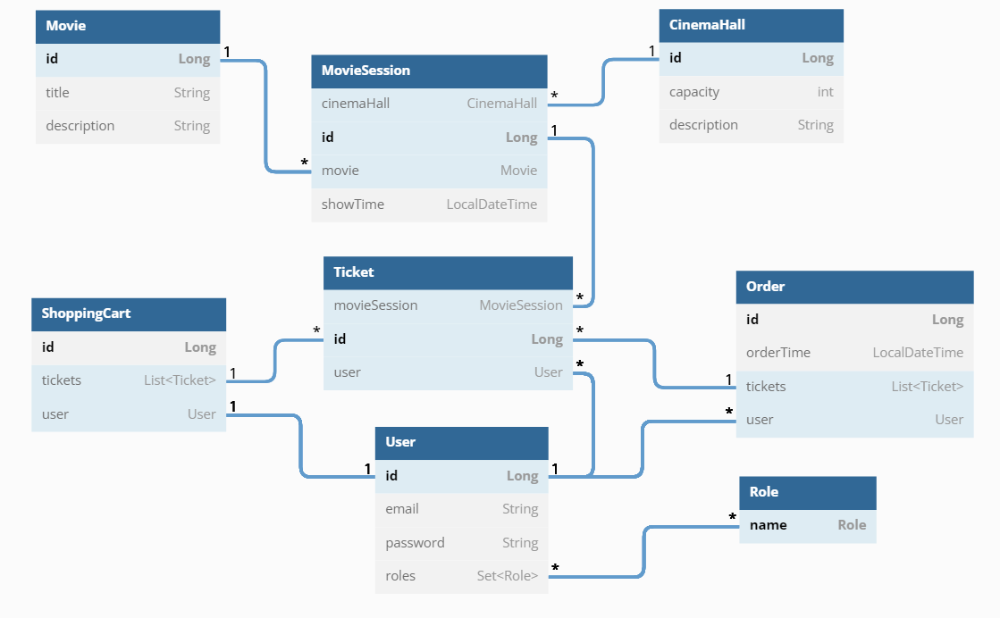

# 	:tickets: Cinema App :tickets:

## :technologist:General overview 

This is a simple REST API that allow to manage cinema's ticket system as an administrator and ordering tickets as a user. It supports authentication and authorization.

## :desktop_computer:Used technologies 

- Java 11
- Maven
- Apache Tomcat
- MySQL
- Spring Core
- Spring MVC
- Spring Security
- Hibernate

# :ladder:API architecture

- Controllers
- Services
- Repositories

All endpoints send and receive JSON data, except login and logout pages. It is generated by SPRING security.
Almost all the endpoints are secured by role based authorization. For more details check `SecurityConfig` class.

# :classical_building:REST endpoints

CRUD operations could be accessed via following endpoints:
<pre>
ALL permissions:
[POST]   /register - create new user
[GET]    /cinema-halls - returns all cinema halls
[GET]    /movies - returns all movies
[GET]    /movie-sessions/available?movieId={movieId}&date={dd.MM.yy} - returns all available movie sessions for the selected movie at the selected date

USER permissions:
[GET]    /shopping-carts/by-user - returns shopping cart of logged user
[PUT]    /shopping-carts/movie-sessions?movieSessionId={movieSessionId} - adds a movie session to shopping cart
[POST]   /orders/complete - completes an order
[GET]    /orders - returns order history of user

ADMIN permissions:
[POST]   /cinema-halls - creates a new cinema hall
[POST]   /movies - creates a new movie
[POST]   /movie-sessions - creates a new movie session
[PUT]    /movie-sessions/{id} - updates a movie session
[DELETE] /movie-sessions/{id} - deletes a movie session
[GET]    /users/by-email - returns user by email
</pre>

To log in / log out use (created by Spring Security):
<pre>
[POST]   /login - log in existing user
[POST]   /logout - log out user
</pre>

# :bricks:DB diagram

# :runner:How to run this project?

1. Clone this project to IDE
2. Install and configure MySQL and Apache Tomcat v 9.0.64
3. Setup database parameters in `resources/db.properties`
4. Run project
5. To log in as admin use:
   - email: admin@i.ua
   - password: admin123
6. To register new user send [POST] request to /register with body:
<pre>
{
   "email":"your_email",
   "password":"your_password",
   "repeatPassword":"your_password"
}
</pre>
7. After that you can log in as user
